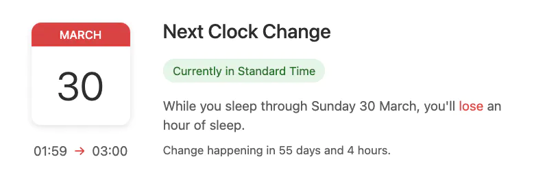

    
    
    
    

    

    <a href="https://dst.osc.garden">Try it now!</a>

A minimalist web app that shows when your next clock change is happening and how it will affect your sleep. It detects your timezone and shows a countdown to the next Daylight Saving Time transition.

Wondering how to handle the time change without disrupting your sleep? Check out [nemui](https://nemui.osc.garden) ([repo](https://github.com/welpo/nemui)), a sleep schedule planner that can help you gradually adjust to the new time.

## Features

- Automatic timezone detection
- Shows:
  - Exact date and time of the change
  - Whether you'll gain or lose an hour of sleep
  - Countdown to the transition
  - Current DST status
- Dark mode support
- Handles all types of time changes:
  - Standard DST transitions
  - Partial-hour changes
  - Different DST schedules worldwide

## Contributing

Contributions are welcome! The app is built with vanilla JavaScript, HTML, and CSS. To run locally:

1. Clone the repository: `git clone https://github.com/welpo/dst.git`
2. Navigate to the directory: `cd dst/app`
3. Start a local server: `python3 -m http.server`
4. Visit `http://localhost:8000` in your browser

The app consists of three main files:

- `index.html`: Basic structure
- `styles.css`: Styles
- `app.js`: Time change detection and display logic

## Need help?

- Questions or ideas → [Start a discussion](https://github.com/welpo/dst/discussions)
- Found a bug? → [Report it](https://github.com/welpo/dst/issues/new?&labels=bug)
- Feature request? → [Let me know](https://github.com/welpo/dst/issues/new?&labels=feature)

## License

nemui is free software: you can redistribute it and/or modify it under the terms of the [GNU General Public License as published by the Free Software Foundation](./COPYING), either version 3 of the License, or (at your option) any later version.
